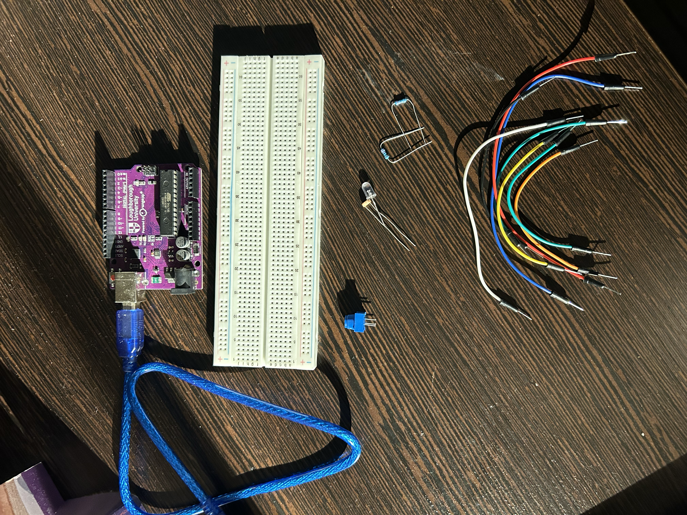
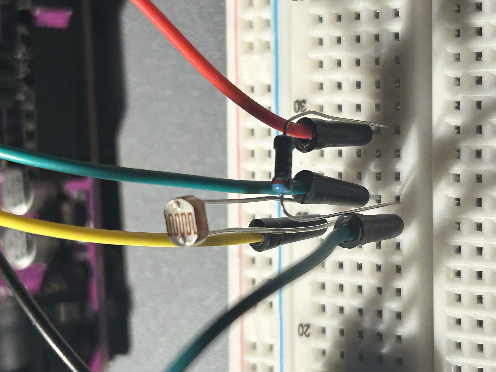
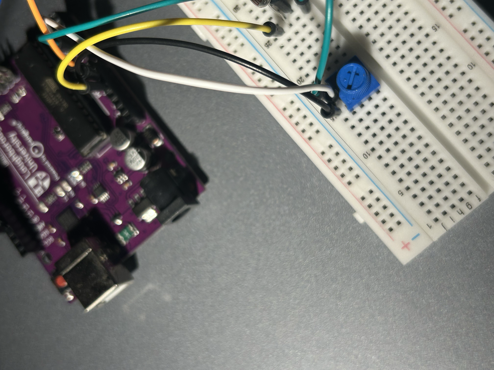
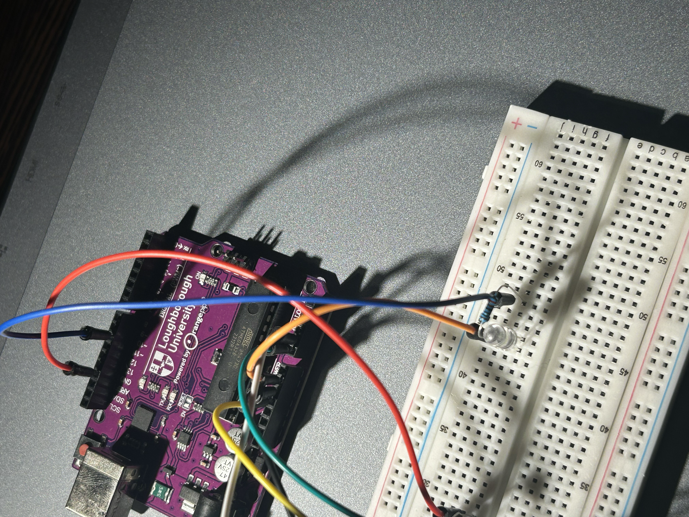
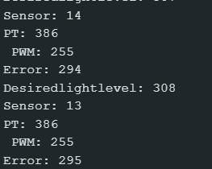
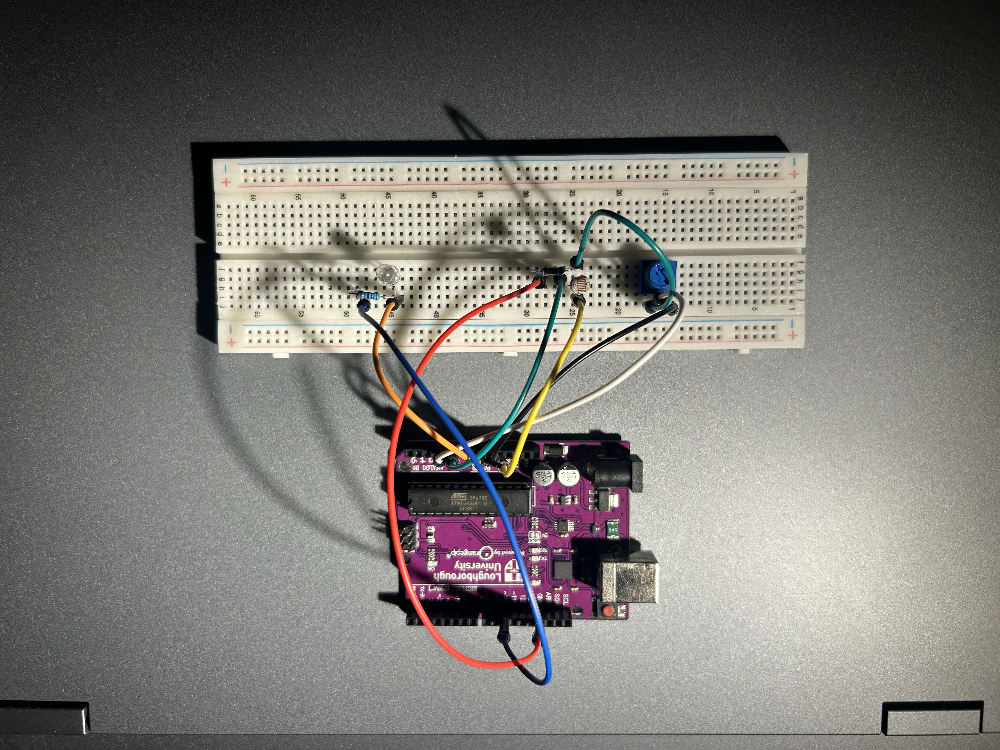
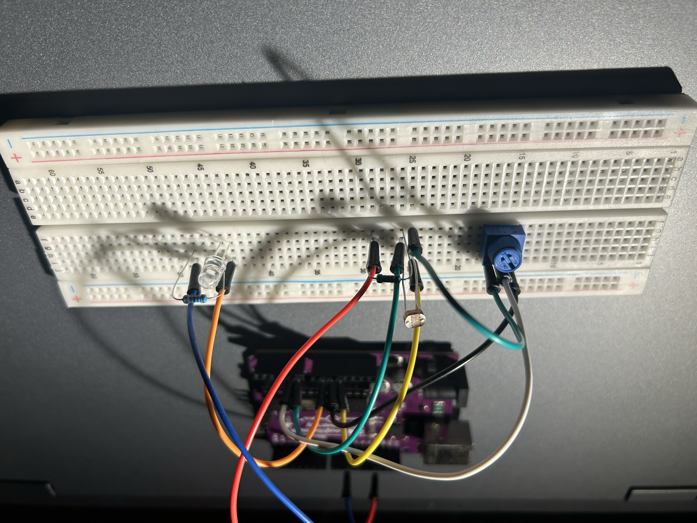

# Closed-Loop-Ambient-Lighting-Controller
# Project Overview:
A closed-loop embedded lighting control system that uses an LDR for ambient light measurement and a potentiometer for user-defined illumination, with error -based PWM control of LED brightness.


# System Variables & Nomenclature:

| Variable            | Meaning                        | Description                                                                                                                                                           |
| ------------------- | ------------------------------ | --------------------------------------------------------------------------------------------------------------------------------------------------------------------- |
| `ldrValue`          | **LDR sensor reading**         | Raw analogue reading obtained from the photoresistor via Arduino pin A0. It represents the measured ambient light level.                                              |
| `ptValue`           | **Potentiometer reading**      | Raw analogue reading obtained from the potentiometer via Arduino pin A1. It represents the user's selected illumination setting.                                      |
| `desiredlightlevel` | **Desired illumination level** | The potentiometer reading after being mapped onto the same scale as the LDR measurement. This represents the illumination level the user wants the system to achieve. |
| `error`             | **Control error**              | Difference between the desired illumination and the measured illumination.                                                                                            |
| `correction`        | **PWM correction**             | Magnitude of the adjustment applied to the current PWM value based on the size of the error.                                                                          |
| `pwmValue`          | **PWM output value**           | Current PWM command sent to the LED through pin D10. It ranges from 0–255.                                                                                            |


## Objectives

The objectives of this project were to:

* Measure ambient light using an LDR/photoresistor.
* Read continuously varying analogue signals using the Arduino ADC.
* Convert raw ADC measurements into useful engineering values.
* Allow the user to define a desired illumination level using a potentiometer.
* Calculate the error between desired and measured illumination.
* Use the magnitude and sign of the error to determine the required correction.
* Control LED brightness using PWM.
* Implement output constraints so the PWM value remains within the valid 0–255 range.
* Develop an understanding of closed-loop feedback control using a physical embedded system.


## System Concept

The project began as a simple automatic lighting system:

**Ambient light → LDR → Arduino → PWM → LED**

The LDR detects changes in the surrounding environment. The Arduino reads the sensor and adjusts the LED brightness depending on whether the environment is relatively bright or dark.

The system was then upgraded by introducing a **potentiometer as a user-defined setpoint**.

The final system operates as:

```text
              USER
                │
                ▼
        Potentiometer
                │
                ▼
      Desired illumination
                │
                │
                ▼
          ┌──────────┐
          │  ERROR   │◄──────── LDR measurement
          │ Setpoint │
          │    -     │
          │ Measured │
          └────┬─────┘
               │
               ▼
       Error-based correction
               │
               ▼
             PWM
               │
               ▼
              LED
               │
               ▼
       Ambient illumination
               │
               ▼
              LDR
               │
               └────────── Feedback
```

This transforms the project from a simple sensor-controlled LED into a **closed-loop feedback control system**.


## Hardware

The complete hardware used was:

| Component         | Purpose                             |
| ----------------- | ----------------------------------- |
| Arduino/Kona 328  | Microcontroller and control logic   |
| LDR/photoresistor | Measures ambient light              |
| Fixed resistor    | Forms the LDR potential divider     |
| Potentiometer     | Sets the desired illumination level |
| LED               | Provides controllable light output  |
| LED resistor      | Limits current through the LED      |
| Breadboard        | Circuit construction                |
| Jumper wires      | Electrical connections              |




## LDR Light Measurement

The LDR changes resistance depending on the amount of light reaching its surface.

It was incorporated into a potential-divider circuit so that changes in resistance produced a changing voltage.

The Arduino's analogue-to-digital converter (ADC) then converted this voltage into a numerical reading.

The LDR was connected to:

```text
A0
```

The Arduino therefore produced a raw sensor value within its ADC range.

I performed an initial test to determine the range that the LDR was operating at. I covered the LDR and noted the reading down (0). I shone a flashlight over the LDR and wrote down the reading (817) and finally I wrote down the value that the LDR remained at (576). This process allowed me to determine the LDR's operating range which was 0-817.




## Potentiometer as the User Setpoint

The potentiometer was used as a **user control rather than as a direct LED brightness control**.

Its output was connected to:

```text
A1
```

The potentiometer produces a continuously varying voltage, which the Arduino reads using `analogRead()`.

The raw potentiometer reading is then mapped onto the same scale used for the desired illumination.

This allows the user to effectively specify:

> "This is the level of ambient illumination I want the system to maintain."




## Desired Illumination

The potentiometer produces an ADC value between 0 and 1023.

This value was converted to the desired illumination scale using a mapping calculation.

The implemented calculation was:

```cpp
int desiredlightlevel = ((long)ptValue * 817) / 1023;
```

The use of `long` for the intermediate multiplication was important because the multiplication could exceed the maximum value that a 16-bit `int` can safely store.

### Integer Overflow Debugging

During testing, unexpected negative values appeared when calculating:

```text
PT × 817
```

This initially suggested that the potentiometer or mapping calculation was incorrect.

The actual issue was **integer overflow** during the intermediate multiplication.

For example:

```text
1023 × 817 = 835,791
```

which is greater than the maximum positive value of a 16-bit signed integer:

```text
32,767
```

Casting the potentiometer value to `long` prevented the overflow:

```cpp
((long)ptValue * 817)
```

This was an important debugging exercise because the individual ADC reading was valid; the error occurred during the subsequent mathematical operation.


## Error Calculation

The controller calculates the difference between the desired and measured illumination:

```cpp
int error = desiredlightlevel - ldrValue;
```

Therefore:

[
Error = Desired illumination - Measured illumination
]

The sign of the error determines the direction of the correction.

### Positive Error

If:

```text
Desired > Measured
```

then:

```text
Error > 0
```

The environment is darker than the desired level, so the LED brightness needs to increase.

### Negative Error

If:

```text
Desired < Measured
```

then:

```text
Error < 0
```

The environment is brighter than the desired level, so the LED brightness needs to decrease.

### Zero Error

If:

```text
Desired = Measured
```

then:

```text
Error = 0
```

No brightness correction is required.


## PWM Control

The LED brightness was controlled using PWM through digital pin:

```text
D10
```

The PWM value ranges from:

```text
0 → 255
```

where:

* `0` = 0% duty cycle
* `255` = approximately 100% duty cycle

The Arduino uses the PWM value to control the proportion of time the digital output remains HIGH during each PWM cycle.

This allows the LED to appear brighter or dimmer without requiring a continuously variable analogue voltage from the digital output.

The final output was generated using:

```cpp
analogWrite(10, pwmValue);
```



**LED operating at different brightness levels**[Watch the video](https://youtube.com/shorts/F8WJ5LutvkU?feature=share)

## Error-Based Correction

The magnitude of the error was converted into the PWM scale:

```cpp
int correction = ((long)abs(error) * 255) / 1634;
```

The absolute value was used to determine the **magnitude** of the correction, while the original error retained its sign to determine whether the PWM should increase or decrease.

Conceptually:

```text
Positive error → increase PWM
Negative error → decrease PWM
Zero error     → no correction
```

The PWM output was also constrained:

```cpp
if (pwmValue > 255) {
    pwmValue = 255;
}
```

and:

```cpp
if (pwmValue < 0) {
    pwmValue = 0;
}
```

This prevents the controller from producing values outside the valid PWM range.


## Control Algorithm

The overall control process can be summarised as:

```text
1. Read LDR
2. Read potentiometer
3. Convert potentiometer reading to desired illumination
4. Calculate error
5. Determine correction magnitude
6. If error > 0:
       Increase PWM
7. If error < 0:
       Decrease PWM
8. Constrain PWM between 0 and 255
9. Send PWM signal to LED
10. Repeat continuously
```

This process repeats continuously inside the Arduino's `loop()` function.


## Arduino Implementation

The main control variables were:

```cpp
int ldrValue;
int ptValue;
int desiredlightlevel;
int error;
int correction;
int pwmValue;
```

The persistent PWM state was declared outside the `loop()` function:

```cpp
int pwmValue = 0;
```

This was necessary because the PWM value represents the controller's current state and needs to persist between iterations of the loop.

Declaring it inside a conditional statement would create a local variable rather than maintaining the same PWM state throughout the program.


## Testing & Validation

The system was tested by changing both the potentiometer setting and the surrounding illumination.

### Potentiometer Test

Increasing the potentiometer value increased the desired illumination level.

When the desired illumination became greater than the measured LDR value:

```text
Error > 0
```

and the PWM increased.

The PWM eventually saturated at:

```text
255
```

when the maximum output brightness was reached.

Reducing the potentiometer value reduced the desired illumination level. If the measured illumination was then greater than the desired level:

```text
Error < 0
```

and the PWM decreased towards:

```text
0
```

**Potentiometer Changing Values**[Watch the video](https://youtube.com/shorts/AuaIwTohmhY?feature=share)


### LDR Test

The LDR was tested by changing the amount of light reaching its surface.

The sensor response was observed through the Arduino Serial Monitor.

Covering the LDR changed the measured light level and caused the controller to alter the LED output.

A light source was also placed near the sensor to observe the response to increased illumination.


**Project Demonstration**[Watch the video](https://youtube.com/shorts/PrqWZVrqvLQ?feature=share) - video


## Serial Monitor

The Serial Monitor was used extensively during development to observe:

```text
Sensor value
Potentiometer value
Desired light level
Error
PWM value
```

Example output:

```text
Sensor: 41
PT: 48
Error: -66
Desiredlightlevel: -25
PWM: 0
```

The Serial Monitor was particularly useful for identifying mathematical and programming errors during development.




## Problems Encountered & Debugging

### 1. PWM Variable Scope

Initially, `pwmValue` was declared inside conditional statements.

This caused errors such as:

```text
'pwmValue' was not declared in this scope
```

The issue was resolved by declaring the variable outside the conditional logic so that it could persist across iterations of the main loop.


### 2. Incorrect `else` Syntax

An incorrect `else` structure was initially used when checking for zero error.

The control logic was simplified so that positive and negative error conditions were handled independently, while zero error naturally resulted in no correction.


### 3. Potentiometer Debugging

The potentiometer initially appeared not to be working within the main program.

A separate test sketch was created using:

```cpp
analogRead(A1);
```

This confirmed that the potentiometer was functioning correctly and producing values across the expected ADC range.

This demonstrated the importance of **isolating individual hardware components during debugging**.


### 4. Integer Overflow

A significant issue occurred during the potentiometer mapping calculation.

The expression:

```cpp
ptValue * 817
```

could exceed the maximum value supported by a 16-bit `int`.

This produced unexpected negative values.

The issue was resolved by using a larger integer type for the intermediate calculation:

```cpp
((long)ptValue * 817)
```

The same principle was applied to the correction calculation.


## Final System Behaviour

The completed controller demonstrates the following behaviour:

### When the desired illumination is increased

```text
Potentiometer ↑
      ↓
Desired illumination ↑
      ↓
Error becomes positive
      ↓
PWM increases
      ↓
LED brightness increases
```

### When the desired illumination is decreased

```text
Potentiometer ↓
      ↓
Desired illumination ↓
      ↓
Error becomes negative
      ↓
PWM decreases
      ↓
LED brightness decreases
```

The controller therefore allows the user to select a desired illumination level while the LDR continuously provides information about the actual environment.


## Engineering Analysis

The key development in this project was the transition from a simple sensor-controlled output to a **closed-loop control architecture**.

The LDR does not directly determine the LED brightness.

Instead:

* The **potentiometer establishes the setpoint**.
* The **LDR measures the actual environmental condition**.
* The **error represents the difference between the desired and measured conditions**.
* The **controller uses this error to determine the direction and magnitude of the PWM correction**.
* The **LED acts as the system's controllable output**.

This creates a feedback relationship in which the system continuously responds to changes in its environment.

The project therefore introduced practical concepts including:

* Setpoints
* Feedback
* Error signals
* Sensor measurement
* ADC conversion
* Signal mapping
* PWM
* Saturation limits
* Embedded control logic
* Debugging
* Integer overflow
* State variables


## Limitations

The current controller uses a relatively simple error-based correction strategy.

It does not yet implement a full PID controller.

As a result, depending on the environment and selected setpoint, the system may not settle perfectly at zero error and may require further tuning to improve stability and responsiveness.


## Future Improvements

Potential improvements include:

* Implementing proportional control.
* Developing a full PID controller.
* Improving the mapping between sensor readings and illumination.
* Adding a second LED or higher-power lighting output.
* Adding a display showing the desired and measured illumination.
* Logging sensor data for analysis.
* Implementing the controller on an FPGA using VHDL/RTL.


## Skills Demonstrated

### Electronics

* Potential-divider circuits
* LDR/photoresistor operation
* LED current limiting
* Breadboard prototyping
* Analogue signal measurement

### Embedded Systems

* Arduino programming
* `analogRead()`
* `analogWrite()`
* Digital outputs
* ADC measurements
* PWM

### Control Engineering

* Setpoints
* Feedback loops
* Error calculation
* Error-based correction
* Output saturation
* Closed-loop system design

### Programming

* C/C++ syntax
* Conditional logic
* Variables and scope
* Integer arithmetic
* Debugging
* Serial communication

### Engineering Problem Solving

* Hardware isolation testing
* Serial-monitor debugging
* Identifying integer overflow
* Mapping different numerical scales
* Iterative system development


## Project Development Journey

The project evolved from a simple automatic LED system into a closed-loop controller.

```text
LDR
 ↓
Measure ambient light
 ↓
Arduino
 ↓
PWM
 ↓
LED
```

was developed into:

```text
User Setpoint
     ↓
Potentiometer
     ↓
Desired Illumination
     ↓
     ┌───────────────┐
     │ Error         │
     │ Desired-Actual│
     └───────┬───────┘
             ↓
      PWM Correction
             ↓
            LED
             ↓
     Ambient Environment
             ↓
            LDR
             │
             └──── Feedback
```

This progression provided a practical introduction to **embedded feedback control** and establishes a foundation for more advanced control and digital hardware projects.


## Final Set-up





## Conclusion

The Closed-Loop Ambient Lighting Controller successfully combines analogue sensing, user input, embedded programming and PWM-based actuation into a practical feedback-control system.

The project was particularly valuable in demonstrating how an engineering problem can be developed iteratively: starting with a basic sensor-controlled output, identifying the limitations of that approach, introducing a user-defined setpoint, developing an error-based correction strategy, debugging the implementation and finally producing a functioning closed-loop system.

The project provides a foundation for more advanced work involving **proportional/PID control, digital control, FPGA implementation and RTL design**.
